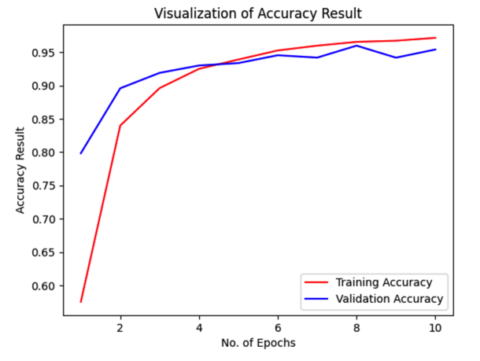
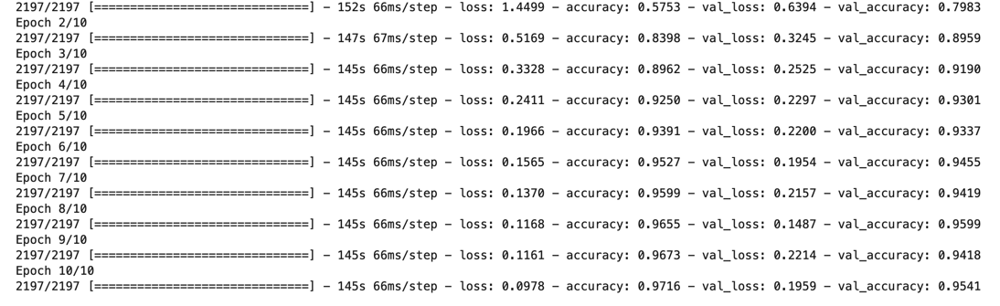
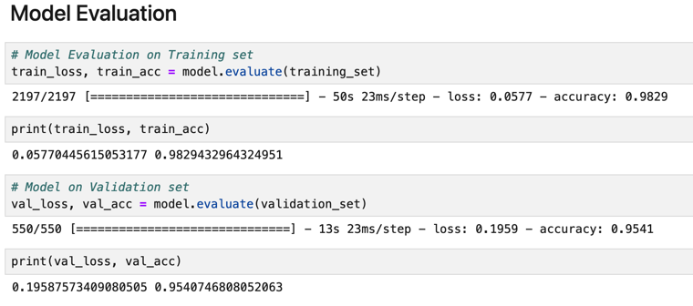
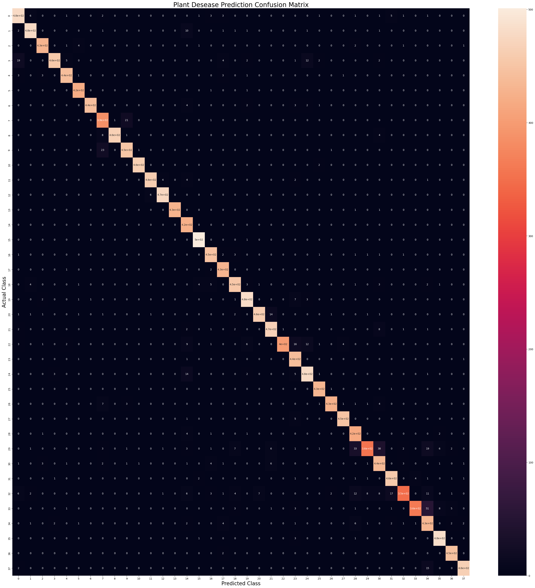

# Plant Disease Detection

A multi-class plant disease detection machine learning workflow:
* Kaggle Dataset (see link below)
* Tensorflow preprocessing
* Sequential model, CNN (Convolutional Neural Network)
* Keras Adam Optimizer compiling
* Training/Evaluation/Saving
* Testing 👍

## Data link

Plant Disease Detection: https://www.kaggle.com/datasets/vipoooool/new-plant-diseases-dataset

## Local Data Architecture

```
📂test
 ┣ 📜AppleCedarRust1.JPG
 ┣ 📜AppleCedarRust2.JPG
 ┣ 📜AppleCedarRust3.JPG
 ┣ 📜AppleCedarRust4.JPG
 ┣ 📜AppleScab1.JPG
 ┣ 📜AppleScab2.JPG
 ┣ 📜AppleScab3.JPG
 ┣ 📜CornCommonRust1.JPG
 ┣ 📜CornCommonRust2.JPG
 ┣ 📜CornCommonRust3.JPG
...
📂train
 ┣ 📂Apple___Apple_scab
 ┣ 📂Apple___Black_rot
...
📂valid
...
📜Train_plant_disease.ipynb
...
```

## Visualizations








